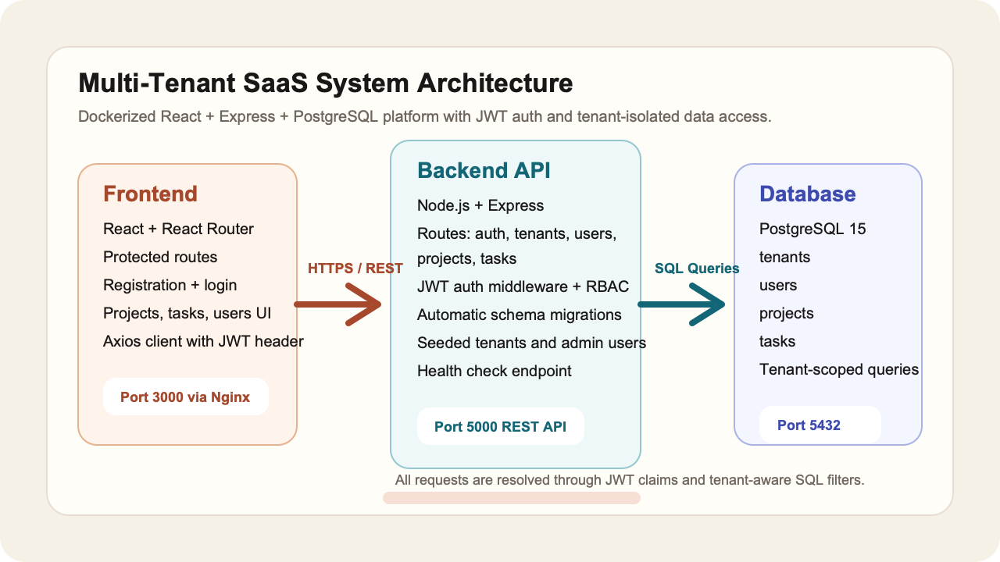
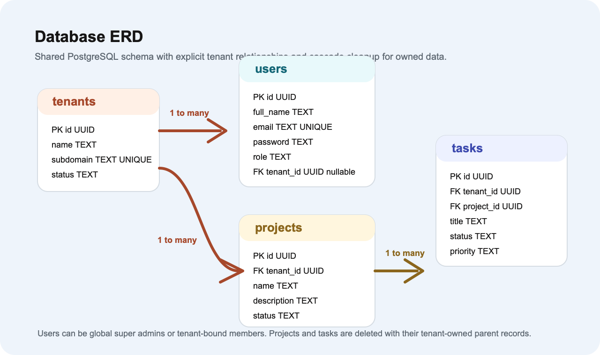

# System Architecture

## Overview
This platform uses a shared PostgreSQL database with application-level tenant isolation. Every authenticated request carries a JWT that includes the tenant context, and every tenant-owned query is filtered by that tenant identifier before data is returned.

## Architecture Diagram
System architecture diagram: `docs/images/system-architecture.png`

## Runtime Components
### Frontend
- React single-page application served through Nginx on port `3000`
- Handles tenant registration, login, dashboard summaries, project workflows, and user management
- Uses an Axios client that automatically attaches the JWT to protected requests

### Backend
- Express API on port `5000`
- Exposes authentication, tenant, user, project, and task endpoints
- Runs database migrations and seed data during startup
- Enforces role-based access control and tenant-aware authorization checks

### Database
- PostgreSQL on port `5432`
- Shared schema with explicit foreign keys between `tenants`, `users`, `projects`, and `tasks`
- Seed data includes multiple tenants to validate isolation boundaries

## Data Flow
1. A tenant admin signs in with email, password, and tenant subdomain.
2. The backend validates credentials, issues a JWT, and returns tenant metadata.
3. Protected frontend routes call the API with the JWT in the `Authorization` header.
4. The backend middleware reads the token, attaches the user context, and limits data access to the current tenant unless the user is a super admin.

## Isolation Strategy
- `users`, `projects`, and `tasks` store `tenant_id`
- Project and task queries always include the authenticated tenant scope
- Tenant admins can manage only their own tenant
- Super admins can view cross-tenant records when needed for platform operations

## Deployment Topology
- `docker compose` brings up database, backend, and frontend services
- Backend waits for the database health check before starting
- Frontend is built with the API base URL configured at build time

## Database ERD
Database ERD diagram: `docs/images/database-erd.png`

